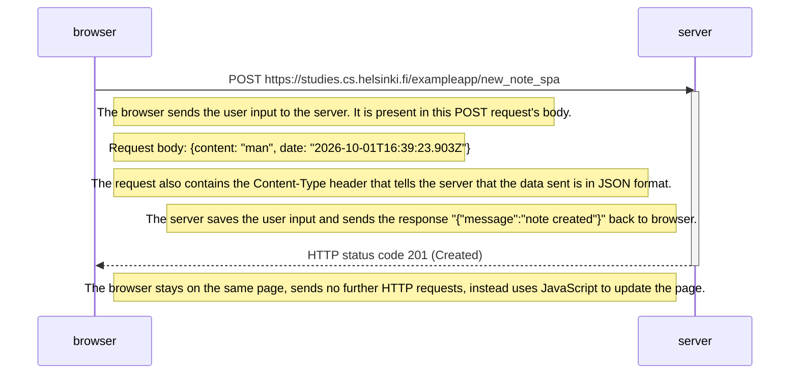

```mermaid
sequenceDiagram
participant browser
participant server

    browser->>server: POST https://studies.cs.helsinki.fi/exampleapp/new_note_spa

    activate server

    Note right of browser: The browser sends the user input to the server. It is present in this POST request's body.

    Note right of browser: Request body: {content: "man", date: "2026-10-01T16:39:23.903Z"}

    Note right of browser: The request also contains the Content-Type header that tells the server that the data sent is in JSON format.

    Note left of server: The server saves the user input and sends the response "{"message":"note created"}" back to browser.

    server-->>browser: HTTP status code 201 (Created)

    deactivate server

    Note right of browser: The browser stays on the same page, sends no further HTTP requests, instead uses JavaScript to update the page.
```
